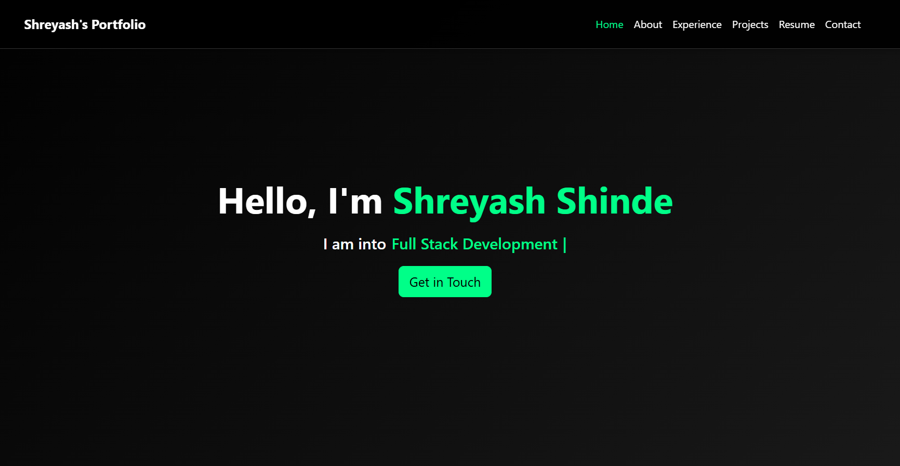
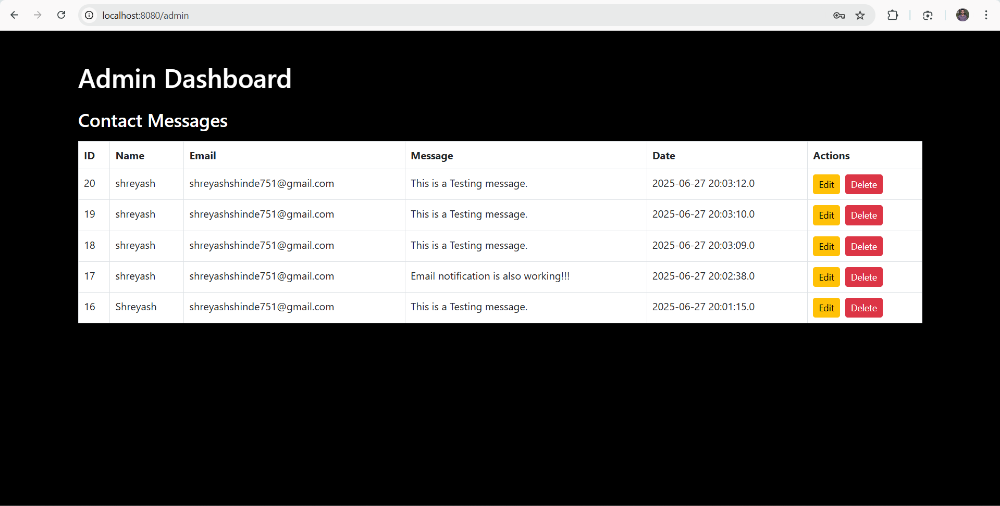

# Java-HTTP-Server-Based-Portfolio-and-Admin-Interface

A custom, lightweight HTTP server built from scratch in Java. This project serves a responsive personal portfolio website and includes a secure admin interface for managing contact form submissions, complete with database integration and email notifications.




## Table of Contents
- [Features](#features)
- [Tech Stack](#tech-stack)
- [Prerequisites](#prerequisites)
- [Setup and Installation](#setup-and-installation)
  - [1. Clone the Repository](#1-clone-the-repository)
  - [2. Set Up the Database](#2-set-up-the-database)
  - [3. Configure the Application](#3-configure-the-application)
  - [4. Compile and Run](#4-compile-and-run)
- [Usage](#usage)
- [API Endpoints](#api-endpoints)
- [Project Structure](#project-structure)

## Features

- **Custom HTTP Server**: Built from the ground up using Java's `java.net` library to handle HTTP requests.
- **Static File Serving**: Serves HTML, CSS, JavaScript, and image files for the portfolio website.
- **RESTful API**: Provides endpoints for CRUD (Create, Read, Delete) operations on contact messages.
- **MySQL Integration**: Connects to a MySQL database to persist and manage messages.
- **Secure Admin Panel**: A separate admin page to view and delete messages, protected by a security token.
- **Email Notifications**: Automatically sends an email notification to the administrator when a new contact message is received.

## Tech Stack

- **Backend**: Java 11+
- **Database**: MySQL
- **Frontend**: HTML, CSS, JavaScript
- **Frameworks/Libraries**: Bootstrap 5

## Prerequisites

Before you begin, ensure you have the following installed on your system:

- **Java Development Kit (JDK)**: Version 11 or higher.
- **MySQL Server**: An active instance of MySQL.
- **Git**: For cloning the repository.
- **A Google Account**: For sending email notifications via Gmail's SMTP server.

## Setup and Installation

Follow these steps to get the project running on your local machine.

### 1. Clone the Repository

Open your terminal or command prompt and run the following command:

```bash
git clone https://github.com/shreyashshinde27/Java-HTTP-Server-Based-Portfolio-and-Admin-Interface.git
cd Java-HTTP-Server-Based-Portfolio-and-Admin-Interface
```

### 2. Set Up the Database

1.  Connect to your MySQL server.
2.  Create a new database for the project.

    ```sql
    CREATE DATABASE my_http_server;
    ```

3.  Use the new database and create the `messages` table with the following schema:

    ```sql
    USE my_http_server;

    CREATE TABLE messages (
        id INT AUTO_INCREMENT PRIMARY KEY,
        name VARCHAR(255) NOT NULL,
        email VARCHAR(255) NOT NULL,
        message TEXT NOT NULL,
        timestamp TIMESTAMP DEFAULT CURRENT_TIMESTAMP
    );
    ```

### 3. Configure the Application

1.  **Create the Config File**: In the root of the project, find the `config.properties` file. Enter your email and App password in it. follow Step - 3 to Create App password if you don't have it.

2.  **Update Database Credentials**: Open `DatabaseManager.java` and fill in your MySQL database details.

    ```properties
    db.url=jdbc:mysql://localhost:3306/my_http_server
    db.user=your_mysql_username
    db.password=your_mysql_password
    ```

3.  **Set Up Email Notifications (Google App Password)**:
    To allow the Java application to send emails through your Gmail account securely, you need to generate a 16-digit "App Password".

    - Go to your Google Account.
    - Navigate to the **Security** tab.
    - Under "How you sign in to Google," ensure **2-Step Verification** is turned **On**. You cannot create an App Password without it.
    - On the same page, click on **App passwords**. You may be asked to sign in again.
    - Click on **"Select app"** and choose **"Mail"**.
    - Click on **"Select device"** and choose **"Other (Custom name)"**.
    - Give it a descriptive name like `Java Portfolio Server` and click **Generate**.
    - Google will generate a **16-character password**. Copy this password (without spaces).

    OR

    - visit this URL to create one - https://myaccount.google.com/apppasswords

    Now, paste this password into your `config.properties` file along with your Gmail address.

    ```properties
    email.username=your-email@gmail.com
    email.password=the16characterapppassword
    ```

4.  **Set Admin Token**: Create a secret token for accessing the admin panel.

    ```properties
    admin.token=admin-secret-token
    ```

### 4. Compile and Run

Make sure you have downloaded the MySQL Connector/J and placed the `.jar` file inside a `lib` directory in the project root.

Open your terminal in the project's root directory and run the following commands.

**Compile the Java source files:**
*(Note: Use `;` as a classpath separator on Windows and `:` on macOS/Linux)*

```bash
# For Windows
javac -d . -cp ".;lib/mysql-connector-j-9.3.0.jar;lib/jbcrypt-0.4.jar;lib/jakarta.mail-2.0.1.jar;lib/jakarta.activation-2.0.1.jar" src/*.java
```

**Run the HTTP Server:**

```bash
# For Windows
java -cp ".;lib/mysql-connector-j-9.3.0.jar;lib/jbcrypt-0.4.jar;lib/jakarta.mail-2.0.1.jar;lib/jakarta.activation-2.0.1.jar" HttpServer
```

You should see the output `Server started on port 8080`.

## Usage

- **View the Portfolio**: Open your web browser and navigate to `http://localhost:8080`.
- **Access the Admin Panel**: Navigate to `http://localhost:8080/admin`. You will be prompted to enter the `admin.token` which is `admin-secret-token`.

## API Endpoints

| Method | Endpoint             | Description                                          | Authentication |
|--------|----------------------|------------------------------------------------------|----------------|
| `POST` | `/api/messages`      | Submits a new message from the contact form.         | None           |
| `GET`  | `/api/messages`      | Retrieves all messages.                              | Admin Token    |
| `DELETE`| `/api/messages/{id}` | Deletes a specific message by its ID.                | Admin Token    |

## Project Structure

```
JAVA HTTP SERVER-BASED PORTFOLIO AND ADMIN INTERFACE
├── lib
│   ├── jakarta.activation-2.0.1.jar
│   ├── jakarta.mail-2.0.1.jar
│   ├── jbcrypt-0.4.jar
│   └── mysql-connector-j-9.3.0.jar
├── src
│   ├── ContactMessage.java
│   ├── DatabaseManager.java
│   ├── EmailSender.java
│   ├── HttpRequest.java
│   ├── HttpResponse.java
│   ├── HttpServer.java
│   ├── MessageHandlers.java
│   ├── RequestHandler.java
│   ├── RouteHandler.java
│   └── Router.java
├── web
│   ├── admin
│   ├── assets
│   ├── bootstrap
│   ├── css
│   ├── js
│   ├── download_bootstrap.ps1
│   └── index.html
└── README.md
└── config.properties
```

